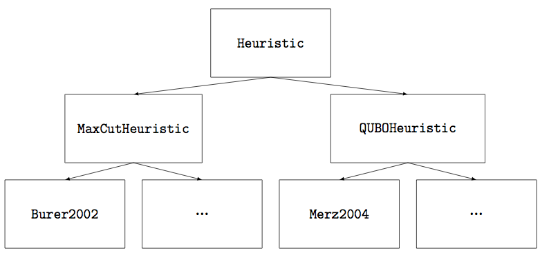
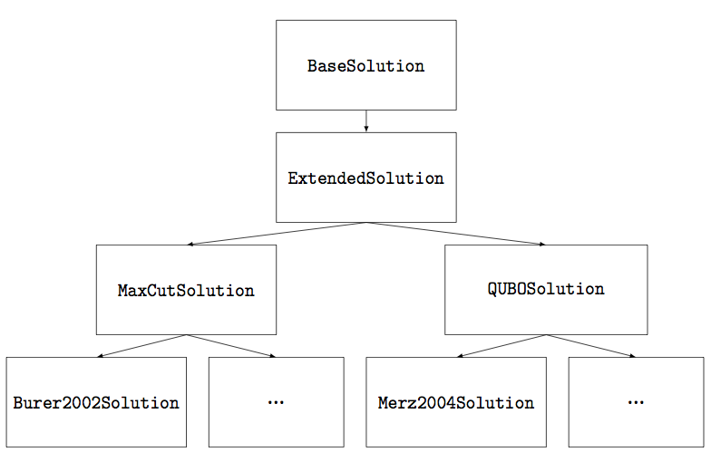

# Developer's Guide

This guide describes how to implement a new Max-Cut or QUBO heuristic using the MQLib code base as well as how to extend the set of problem instance metrics outputted by the library. The first section provides a "hello world" heuristic implementation, focusing on the basics required to implement and run a heuristic as well as details about the `MaxCutHeuristic` and `QUBOHeuristic` classes that are extended when building a new heuristic. The next section delves into the methods and data structures of the `MaxCutSolution` and `QUBOSolution` classes, which represent solutions to the respective problems and have mechanisms that allow efficient solution initialization, evaluation, manipulation, and comparison. Next, we go into detail about the `MaxCutPartialSolution` and `QUBOPartialSolution` classes, which are useful for constructive initialization procedures such as those found in GRASP heuristics. The next section provides details about the `MaxCutInstance` and `QUBOInstance` classes, providing access directly to the problem instance data. The last section describes how to implement new problem instance metrics.

## Implementing a Simple Heuristic

The MQLib code base provides scaffolding the should be extended when implementing new heuristics:



A new Max-Cut heuristic should extend the `MaxCutHeuristic` class (available by including [problem/max_cut_heuristic.h](../include/problem/max_cut_heuristic.h)), and a new QUBO heuristic should extend the `QUBOHeuristic` class (available by including [problem/qubo_heuristic.h](../include/problem/qubo_heuristic.h)). Following the naming conventions of our code base, the heuristic name should combine the last name of the heuristic paper's first author, the year, and a brief description if more than one heuristic is presented in the paper. For instance, a paper by Silberholz et al. published in 2015 presenting a new tabu search procedure and a new genetic algorithm might name the two heuristic classes `Silberholz2015TS` and `Silberholz2015GA`.

Heuristics should be implemented to run in the constructor of their class, returning from the constructor only when the termination criterion has been reached (see below). Heuristics should report new best solutions as they are identified using the `Report` function; the entire time series of new best solutions encountered by a heuristic is reported upon termination when running from the command line (see [bin/README.md](../bin/README.md) for details). There is no harm in calling `Report` on a solution that is not a new best solution (though calling the function a huge number of times may slow down code, even though the function is quite light weight). 

The `Report` function returns a boolean value indicating whether the program should continue. A value of `false` indicates the termination criterion has been reached and that the heuristic should exit its constructor, while a `true` value indicates the procedure should continue. **To prevent heuristics from running much longer than the runtime limit, heuristics should periodically call the `Report` function regardless of whether they have identified a new best solution, using the returned value to determine whether they should terminate.**

Consider now the implementation of a simple "hello world" Max-Cut heuristic that iteratively generates a random solution, performs repeated 1-opt local search on the solution until no more moves are available, and then reports the solution using the `Report` function, exiting when the termination criterion is reached. First we would generate a header file for our heuristic, located at `include/heuristics/maxcut/silberholz2015.h`, which declares our heuristic class to extend `MaxCutHeuristic`:

```
#ifndef HEURISTICS_MAXCUT_SILBERHOLZ_2015_
#define HEURISTICS_MAXCUT_SILBERHOLZ_2015_

#include "problem/max_cut_heuristic.h"

class Silberholz2015 : public MaxCutHeuristic {
 public:
  Silberholz2015(const MaxCutInstance &mi, double rt_limit, bool validation,
                 MaxCutCallback *mc);
};

#endif
```

Next we would implement the heuristic in `src/heuristics/maxcut/silberholz2015.cpp`:

```
#include "heuristics/maxcut/silberholz2015.h"

Silberholz2015::Silberholz2015(const MaxCutInstance &mi, double rt_limit,
                               bool validation, MaxCutCallback *mc) :
  MaxCutHeuristic(mi, rt_limit, validation, mc) {
  while (true) {
    MaxCutSolution sol = MaxCutSolution::RandomSolution(mi, this);
    sol.AllBest1Swap();
    if (!Report(sol)) return;
  }
}
```

Note that the code periodically calls `Report` regardless of whether it has generated a new best solution, ensuring it respects the termination criterion. In this code we instantiate a random Max-Cut solution using `MaxCutSolution::RandomSolution` and perform local search using its `AllBest1Swap` function; we will go into more detail about solution classes in the next section.

The final step to implementing our "hello world" heuristic is to enable it to be run from the command line. This can be done by adding the following line near the top of [src/heuristics/heuristic_factory.cpp](heuristics/heuristic_factory.cpp):

```
#include "heuristics/maxcut/silberholz2015.h"
```

Further, the map `max_cut_map_` in [src/heuristics/heuristic_factory.cpp](heuristics/heuristic_factory.cpp) that stores available Max-Cut heuristics should be augmented with information about the new heuristic.

```
max_cut_map_["SILBERHOLZ2015"] =
  MaxCutCreator(&NewMaxCutHeur<Silberholz2015>, "Local search with random restart");
```

This step enables the heuristic to be run from the command-line interface. The step is also needed for the heuristic to be included in the hyper-heuristic, though additional steps are also required as detailed in [analysis/analyze.R](../analysis/analyze.R).

At this point, the new heuristic is ready to be compiled and run either from the command line using the heuristic code `SILBERHOLZ2015` or by code linking to the MQLib. For more details on compiling the project, see the documentation in [README.md](../README.md). For more details on how to run heuristics, see the documentation located at [bin/README.md](../bin/README.md).

## Solution Classes

As demonstrated in the previous section, MQLib includes solution classes that store complete solutions to the Max-Cut and QUBO problems, providing both common initialization procedures and common operations on solutions such as local searches. The solution classes in the code base have the following structure:



Nearly every Max-Cut heuristic defines a solution class that extends `MaxCutSolution`, including heuristic-specific methods and stored data, and likewise nearly every QUBO heuristic defines a solution class that extends `QUBOSolution`. These base classes store a number of useful pieces of information about a solution as protected class variables:

* `N_`: A convenience variable indicating the number of nodes in the problem instance (Max-Cut) or the number of variables in the problem instance (QUBO).
* `assignments_`: A vector (of length `N_`) storing the solution; values -1 and 1 are used to indicate the two possible set inclusions for Max-Cut solutions and values 0 and 1 are used to indicate variable values in QUBO solutions. Public accessor method `get_assignments` provides access to this vector.
* `weight_`: The objective value of the solution. Public accessor method `get_weight` provides access to this value.
* `diff_weights_`: A vector (of length `N_`) containing the amount that the objective value would change by flipping each element in `assignments_`. Public accessor method `get_diff_weights` provides access to this vector.
* `heuristic_`: A pointer (of type `MaxCutHeuristic*` for Max-Cut solutions and `QUBOHeuristic*` for QUBO solutions) to the heuristic associated with this solution.
* `mi_` (`qi_`): A reference to the `MaxCutInstance` (`QUBOInstance`) associated with a Max-Cut (QUBO) solution.

In addition to these protected variables, the solution classes provide a number of commonly used methods that save implementation effort and provide consistent implementation across heuristics.

### Constructing New Solutions

The `RandomSolution` function (available for both `MaxCutSolution` and `QUBOSolution`) creates new random solutions, optionally providing a vector of probabilities that each index will be assigned value 1. Further, `QUBOSolution` has a function `ZeroSolution` that initializes a solution to all 0 values.

Solutions can also be constructed to be identical to another solution using the copy constructor, or they can be constructed based on a vector of assignments for each node/variable.

Further, new solutions can be constructed by manually setting the values in `assignments_` in the constructor and then calling the `PopulateFromAssignments` function to compute the `weight_` and `diff_weights_` values from these assignments. An example of this sort of constructor can be seen in `Lodi1999Solution`, implemented in file [src/heuristics/qubo/lodi1999.cpp](heuristics/qubo/lodi1999.cpp). In this constructor, elements of `assignments_` are set to a particular value if indicated by a passed vector and are otherwise assigned randomly, and `PopulateFromAssignments` is called after `assignments_` has been populated. **It is critical that `PopulateFromAssignments` is used whenever a solution is constructed by using the default `MaxCutHeuristic` constructor `MaxCutSolution(const MaxCutInstance&, MaxCutHeuristic*)`, because the `diff_weights_` vector is not properly initialized after calling this base constructor (for efficiency reasons). Further, `PopulateFromAssignments` must be called whenever the `assignments_` vector is manipulated directly, or else the `diff_weights_` vector and `weight_` value may be out of date.** Note that for efficiency purposes it is often preferable to construct a solution with a specified `assignments_` vector by copying an existing solution and modifying the indices that differ using the `UpdateCutValues` function (see below). Such an approach is common when constructing new solutions via crossover in a genetic algorithm; see for instance the constructor for `Hasan2000Solution` in [src/heuristics/qubo/hasan2000.cpp](heuristics/qubo/hasan2000.cpp).

Some heuristics (notably GRASP heuristics) have more involved construction procedures that maintain information about partially constructed solutions. Such solutions can be constructed using the `MaxCutPartialSolution` and `QUBOPartialSolution` classes (see later in this document for details), and a `MaxCutSolution` or `QUBOSolution` can be constructed from fully assigned partial solution classes.

### Evaluating and Manipulating Solutions

A number of methods evaluate or manipulate a solution:

* `UpdateCutValues`: A method in [heuristics/extended_solution.h](../include/heuristics/extended_solution.h) that flips the assignment at an indicated index, efficiently updating `assignments_`, `weight_`, and `diff_weights_`. This function is efficient in that it only needs to iterate through the neighbors of the indicated node (Max-Cut) / the list of variables with non-zero interactions with the indicated variable (QUBO).
* `ImprovingMove`: A method in [heuristics/extended_solution.h](../include/heuristics/extended_solution.h) that indicates if flipping the assignment at an indicated index will improve a solution (taking into account floating point rounding considerations).
* `NonDetrimentalMove`: A method in [heuristics/extended_solution.h](../include/heuristics/extended_solution.h) that indicates if flipping the assignment at an indicated index will not cause the solution to get worse (taking into account floating point rounding considerations).
* `PopulateFromAssignments`: A method in [heuristics/maxcut/max_cut_solution.h](../include/heuristics/maxcut/max_cut_solution.h) and [heuristics/qubo/qubo_solution.h](../include/heuristics/qubo/qubo_solution.h) that computes `weight_` and `diff_weights_` based on the current values in `assignments_`. This function should be used sparingly because it involves iterating through the full set of edges in the graph (Max-Cut) / the full list of non-zero interactions in the matrix (QUBO).
* `AllBest1Swap`: A method in [heuristics/extended_solution.h](../include/heuristics/extended_solution.h) that identifies the index with the highest `diff_weights_` value, flipping the assignment at this index. This procedure is continued until no more improving moves are possible.
* `AllFirst1Swap`: A method in [heuristics/extended_solution.h](../include/heuristics/extended_solution.h) that identifies the lexicographically first index in `diff_weights_` with a positive value, flipping the assignment at this index. This procedure is continued until no more improving moves are possible.
* `AllShuffle1Swap`: A method in [heuristics/extended_solution.h](../include/heuristics/extended_solution.h) that randomly shuffles the node/variable indices and steps through this list, flipping the first index with a positive `diff_weights_` value. The procedure continues until no more improving moves are possible.
* `AllBest2Swap`: A method in [heuristics/maxcut/max_cut_solution.h](../include/heuristics/maxcut/max_cut_solution.h) and [heuristics/qubo/qubo_solution.h](../include/heuristics/qubo/qubo_solution.h) that identifies the pair of nodes/variables such that when both have their assignment flipped the objective value increases maximally. This procedure is continued until no improving pairs exist.
* `AllFirst2Swap`: A method in [heuristics/maxcut/max_cut_solution.h](../include/heuristics/maxcut/max_cut_solution.h) and [heuristics/qubo/qubo_solution.h](../include/heuristics/qubo/qubo_solution.h) that iterates lexicographically through pairs of nodes/variables, flipping the assignment of both nodes/variables in the pair if it improves the objective value. The method keeps taking improving moves until no such moves exist.
* `DiffWeightStandardDeviation`: A method in [heuristics/extended_solution.h](../include/heuristics/extended_solution.h) that returns the standard deviation of the `diff_weights_` vector.
* `operator=`: A method in [heuristics/maxcut/max_cut_solution.h](../include/heuristics/maxcut/max_cut_solution.h) and [heuristics/qubo/qubo_solution.h](../include/heuristics/qubo/qubo_solution.h) that sets a solution equal to another solution.

### Comparing Two Solutions

Several methods enable the comparison of a pair of solutions:

* `SymmetricDifference`: Several overloaded methods in [heuristics/base_solution.h](../include/heuristics/base_solution.h) that compute the symmetric difference between two solutions, returning the hamming distance and (optionally) the indices that differ and that are the same.
* `ImprovesOver`: A method in [heuristics/base_solution.h](../include/heuristics/base_solution.h) that determines if one solution's objective value is better than another's (taking into account floating point rounding considerations).
* `ImprovesOverAfterMove`: A method in [heuristics/extended_solution.h](../include/heuristics/extended_solution.h) that indicates if flipping the assignment at an indicated index will cause this solution to be better than another solution (taking into account floating point rounding considerations).
* `operator==` / `operator!=`: Methods in [heuristics/base_solution.h](../include/heuristics/base_solution.h) that perform efficient comparison of two solutions to determine if they are identical.
* `operator>=` / `operator<=` / `operator>` / `operator<`: Operators in [heuristics/base_solution.h](../include/heuristics/base_solution.h) that enable solutions to be sorted based on their objective function values.

### Example of Extending Solution Classes

As an example of solution classes in action, we will implement a simple simulated annealing procedure for QUBO, which has 100 temperature stages (temperatures decrease exponentially toward 0). At each temperature stage the heuristic randomly selects `N_/2` indices with replacement, flipping the assignment at that index if it will either improve or not change the objective or with some random probability that depends on the expected decrease in the objective value and the temperature of the procedure. The simulated annealing procedure is run from random starting solutions until the runtime limit is reached.

In our header file `include/heuristics/qubo/silberholz2015.h`, not only will we extend `QUBOHeuristic` with our new heuristic class but we will also extend `QUBOSolution` with our new solution class, creating a simulated annealing method.

```
#ifndef HEURISTICS_QUBO_SILBERHOLZ_2015_
#define HEURISTICS_QUBO_SILBERHOLZ_2015_

#include "problem/qubo_heuristic.h"

class Silberholz2015Solution : public QUBOSolution {
 public:
  // Convert from QUBOSolution to Silberholz2015Solution
  Silberholz2015Solution(const QUBOSolution &x) :
   QUBOSolution(x) {}

  // Simulated annealing procedure
  void SA();
};

class Silberholz2015 : public QUBOHeuristic {
 public:
  Silberholz2015(const QUBOInstance &qi, double rt_limit, bool validation,
                 QUBOCallback *qc);
};

#endif
```

In the source file located at `src/heuristics/qubo/silberholz2015.cpp`, we would include both an implementation of the simulated annealing procedure and the constructor that runs the heuristic.

```
#include <math.h>
#include "heuristics/qubo/silberholz2015.h"
#include "util/random.h"

void Silberholz2015Solution::SA() {
  // Parameters
  int numCycles = 100;
  double initTemp = 1.0;
  double tempMult = 0.95;
  int numFlipPerCycle = N_ / 2;
  
  double temp = initTemp;
  for (int cycle=0; cycle < numCycles; ++cycle) {
    for (int ct=0; ct < numFlipPerCycle; ++ct) {
      int idx = Random::RandInt(0, N_-1);
      if (NonDetrimentalMove(idx) ||
          Random::RandDouble() < exp(diff_weights_[idx] / temp)) {
        UpdateCutValues(idx);
      }
    }
    if (cycle % 10 == 0 && !heuristic_->Report(*this)) return;
    temp *= tempMult;
  }
}

Silberholz2015::Silberholz2015(const QUBOInstance &qi, double rt_limit,
                               bool validation, QUBOCallback *qc) :
  QUBOHeuristic(qi, rt_limit, validation, qc) {
  while (true) {
    Silberholz2015Solution sol = QUBOSolution::RandomSolution(qi, this);
    sol.SA();
    if (!Report(sol)) return;
  }
}
```

As in the first example in this document, several small changes would be needed to [src/heuristics/heuristic_factory.cpp](heuristics/heuristic_factory.cpp) to enable us to run the new heuristic.

Note that this code uses the utility class `Random`, which is included through [util/random.h](../include/util/random.h) and provides functions `RandInt` and `RandDouble` as well as weighted selection from a set through the `RouletteWheel` and `MultiRouletteWheel` functions.

Further, this code periodically reports the current solution during the simulated annealing procedure. This ensures a long-running call to `SA` does not cause the heuristic to run far past the runtime limit.

### Other Solution Classes

In this section we reviewed the `MaxCutSolution` and `QUBOSolution` classes, and in the next section we will review `MaxCutPartialSolution` and `QUBOPartialSolution`. While these are by far the most commonly used solution classes, there are several more implemented that may be useful.

`FixedFirstMaxCutSolution`, provided as part of [heuristics/maxcut/max_cut_solution.h](../include/heuristics/maxcut/max_cut_solution.h), fixes the first node to a specified assignment and does not allow it to change throughout the execution of the procedure. This could help procedures avoid dealing with symmetric Max-Cut solutions with all set inclusions flipped but the same objective value.

`MaxCutSimpleSolution` and `QUBOSimpleSolution`, which extend `BaseSolution` and are included from header files [heuristics/maxcut/max_cut_simple_solution.h](../include/heuristics/maxcut/max_cut_simple_solution.h) as well as [heuristics/qubo/qubo_simple_solution.h](../include/heuristics/qubo/qubo_simple_solution.h), are solution classes that do not track the `diff_weights_` vector. As a result they are cheaper to instantiate and use less memory than `MaxCutSolution` and `QUBOSolution`, though the instantiation and storage costs are asymptotically the same. The simple solution classes do not enable efficient local search, as significant computation would be required to determine the change in objective value from flipping each index.

## Partial Solution Classes

When initializing a new solution, some heuristics use constructive procedures that consider the nodes/variables that have already been assigned when choosing how to assign the remaining values. In such procedures, it is often important to know how the objective function of the partial solution will change for each possible decision with an unassigned node.

The `MaxCutPartialSolution` and `QUBOPartialSolution` classes from the header files [heuristics/maxcut/max_cut_partial_solution.h](../include/heuristics/maxcut/max_cut_partial_solution.h) and [heuristics/qubo/qubo_partial_solution.h](../include/heuristics/qubo/qubo_partial_solution.h) enable such constructive methods. They include the following protected class variables:

* `N_`: A convenience variable indicating the number of nodes in the problem instance (Max-Cut) or the number of variables in the problem instance (QUBO).
* `assignments_`: A vector (of length `N_`) storing the solution. Values -1 and 1 are used to indicate the two possible set inclusions for Max-Cut solutions, and 0 indicates a node that is unassigned. For QUBO solutions, any double value between 0 and 1 (inclusive) is allowed. Public accessor method `get_assignments` provides access to this vector.
* `num_unassigned_`: The number of indices that are not assigned to a feasible value; for Max-Cut solutions this is the number of nodes with assigned value 0 and for QUBO solutions this is the number of variables with assigned values not equal to 0 or 1. Public accessor method `get_num_unassigned` provides access to this value.
* `weight_`: The objective value of the solution. Public accessor method `get_weight` provides access to this value.
* `gainNS_` (`gainS_`): For Max-Cut solutions, a vector (of length `N_`) containing the change in the objective value from assigning each node the value -1 (1). Public accessor methods `get_gainNS` and `get_gainS` provide access to these vectors.
* `diff0_` (`diff1_`): For QUBO solutions, a vector (of length `N_`) containing the change in the objective value from assigning each node the value 0 (1). Public accessor methods `get_diff0` and `get_diff1` provide access to these vectors.
* `heuristic_`: A pointer (of type `MaxCutHeuristic*` for Max-Cut solutions and `QUBOHeuristic*` for QUBO solutions) to the heuristic associated with this solution.
* `mi_` (`qi_`): A reference to the `MaxCutInstance` (`QUBOInstance`) associated with a Max-Cut (QUBO) solution.

Because the partial solution classes are intended for constructing new solutions instead of for manipulating solutions after they have been constructed, they only have two methods: the `UpdateCutValues` method for setting the value of an indicated index and the `PopulateFromAssignments` function to set all relevant class variables from the current values stored in `assignments_`. Unlike with `MaxCutSolution` and `QUBOSolution`, all vectors of gains are properly initialized after the base constructors are called.

To demonstrate extending the partial solution classes, we will implement a GRASP procedure for MAX-CUT. Our procedure will construct a solution by iterating through a shuffled list of vertices; if the vertex improves the solution when added to one set but not with the other set then it will be added to the improving set. Otherwise a randomized selection between the two sets will be performed based on the change in the objective value from assigning the node to each set. Finally, local search is performed. This randomized greedy construction followed by local search is continued until the termination criterion is reached.

We would use the following header in `include/heuristics/maxcut/silberholz2015.h`:

```
#ifndef HEURISTICS_MAXCUT_SILBERHOLZ_2015_
#define HEURISTICS_MAXCUT_SILBERHOLZ_2015_

#include "heuristics/maxcut/max_cut_partial_solution.h"
#include "problem/max_cut_heuristic.h"

class Silberholz2015PS : public MaxCutPartialSolution {
 public:
  Silberholz2015PS(const MaxCutInstance& mi, MaxCutHeuristic* heuristic);
};

class Silberholz2015 : public MaxCutHeuristic {
 public:
  Silberholz2015(const MaxCutInstance &mi, double rt_limit, bool validation,
                 MaxCutCallback *mc);
};

#endif
```

Next we would implement the heuristic in `src/heuristics/maxcut/silberholz2015.cpp`:

```
#include <algorithm>
#include "heuristics/maxcut/silberholz2015.h"
#include "util/random.h"

Silberholz2015PS::Silberholz2015PS(const MaxCutInstance &mi,
                                   MaxCutHeuristic* heuristic) :
  MaxCutPartialSolution(mi, heuristic) {
  std::vector<int> indices(N_);
  for (int i=0; i < N_; ++i) indices[i] = i;
  std::random_shuffle(indices.begin(), indices.end());
  for (int i=0; i < N_; ++i) {
    int idx = indices[i];
    double gNS = gainNS_[idx];
    double gS = gainS_[idx];
    if (gNS > 0 && gS <= 0) {
      UpdateCutValues(idx, -1);
    } else if (gNS <= 0 && gS > 0) {
      UpdateCutValues(idx, 1);
    } else if (gNS == 0 && gS == 0) {
      UpdateCutValues(idx, Random::RandDouble() <= 0.5 ? -1 : 1);
    } else if (gNS > 0) {
      UpdateCutValues(idx, Random::RandDouble() <= gNS / (gNS+gS) ? -1 : 1);
    } else {
      UpdateCutValues(idx, Random::RandDouble() <= gNS / (gNS+gS) ? 1 : -1);
    }
  }
}

Silberholz2015::Silberholz2015(const MaxCutInstance &mi, double rt_limit,
                                   bool validation, MaxCutCallback *mc) :
  MaxCutHeuristic(mi, rt_limit, validation, mc) {
  while (true) {
    MaxCutSolution sol(Silberholz2015PS(mi, this));
    sol.AllBest1Swap();
    if (!Report(sol)) return;
  }
}
```

In this code, a `MaxCutSolution` was constructed from our `MaxCutPartialSolution`, which enabled us to perform local search on our solution after it had been constructed. As usual, edits would be needed in [src/heuristics/heuristic_factory.cpp](heuristics/heuristic_factory.cpp) to be able to run this new heuristic.

## Instance Classes

All heuristics interact with the problem instance, but often through higher-level methods like `UpdateCutValues`, `PopulateFromAssignments`, or a local search procedure. As a result, many heuristics do not need to directly interact with the problem instance. This section addresses how to access problem instance data for heuristic designers who do need lower-level access to the instance. Instances are provided either through the `MaxCutInstance` class or the `QUBOInstance` class.

The `MaxCutInstance` class, declared in [problem/max_cut_instance.h](../include/problem/max_cut_instance.h), stores a graph in a sparse edge list representation, with the following member variables:

* `all_edges_`: A vector of all edges in the graph, of type `Instance::InstanceTuple`, which is a typedef of `std::pair<std::pair<int, int>, double>`. The two integer values stored in the inner pair represent the (0-indexed) endpoints of the edge and the double in the outer pair represents the edge weight. Each edge only appears once in this vector, with its endpoints in increasing order. Access to this vector and iterators are provided by public functions `get_all_edges`, `get_all_edges_begin`, and `get_all_edges_end`.
* `edges_`: A vector storing the edge list from each node to all other nodes, stored as a vector of vectors. The inner vectors are of type `std::pair<int, double>` indicating the (0-indexed) linked node and weight of the link. Access to a node's edge list and iterators for this vector are provided by public functions `get_edges`, `get_edges_begin`, and `get_edges_end`.

The `QUBOInstance` class, declared in [problem/qubo_instance.h](../include/problem/qubo_instance.h), has a similar sparse representation, storing elements of the (symmetric) input matrix with non-zero values in the following member variables:

* `all_nonzero_`: A vector of all non-zero elements `Q_ij, i < j`, in the input matrix `Q`, of type `Instance::InstanceTuple`, which is a typedef of `std::pair<std::pair<int, int>, double>`. For element `Q_ij`, the inner pair stores `i` and `j` (0-indexed) and the last value in the tuple is the value `Q_ij`. Iterators on this vector are provided by public functions `get_all_nonzero_begin` and `get_all_nonzero_end`.
* `nonzero_`: A vector storing the list of all non-zero elements in each row of the input matrix `Q` except any element on the diagonal, stored as a vector of vectors with the inner vector of type `std::pair<int, double>` indicating the (0-indexed) column number of the element and value. Iterators for each row are provided by public functions `get_nonzero_begin` and `get_nonzero_end`.
* `lin_`: A vector containing the main diagonal of input matrix `Q`. This vector can be accessed with public function `get_lin`.

Though instances can be extended (for an example see class `Palubeckis2004bInstance` in [src/heuristics/qubo/palubeckis2004b.cpp](heuristics/qubo/palubeckis2004b.cpp), which extends `QUBOInstance` to construct a perturbed problem instance), the most common use case for the instance classes is using the public iterators to access part or all of the instance information. As an example, let's assume that we wanted to adjust the probability of a downhill move from our previous simulated annealing procedure to make it more instance independent. The probability of taking a downhill move at index `idx` in our earlier implementation was `exp(diff_weights_[idx] / temp)`, which varies greatly based on the scaling of the input matrix: If we multiplied all entries in the input matrix by 10 we would not have meaningfully changed the instance but we would have caused a massive decrease in the probability of taking downhill moves. To avoid this dependence on instance scaling, we could scale the change in the objective value by the average absolute value of the off-diagonal non-zero elements in the QUBO input matrix. To do this, we could compute the average absolute value with the following code in the heuristic constructor before the main loop:

```
double absSum = 0.0;
int numOffDiag = 0;
for (auto iter = qi.get_all_nonzero_begin();
     iter != qi.get_all_nonzero_end(); ++iter) {
  absSum += fabs(iter->second);
  ++numOffDiag;
}
double scalar = numOffDiag > 0 ? absSum / numOffDiag : 1.0;
```

We could pass this scalar to the `SA` function, changing the probability of a non-improving move to `exp(diff_weights_[idx] / scalar / temp)`.

## Implementing New Problem Instance Metrics

There are two major types of metrics for a graph: those that have a single value for the whole graph and those that have a value for different graph elements (e.g. every edge or every node). In this section we will discuss how to implement each type of metric. Note that any changes to the graph metrics will require performing the graph metrics EC2 run described in the [Reproducible Parallel Computation with Amazon Web Services guide](../Cloud/README.md) and running the analysis script [analysis/analyze.R](../analysis/analyze.R) before the hyper-heuristic can be executed.

To implement a new metric that returns a single value for the problem instance, the first step is to add a function computing that metric to the `GraphMetrics` class in [src/metrics/max_cut_metrics.cpp](metrics/max_cut_metrics.cpp). For instance, if we wanted to add a metric measuring the proportion of the graph's edges that attain the maximum edge weight, we might add the following code:

```
double GraphMetrics::GetPropMaxEdges() {
  // Returns the proportion of edges that have the maximum weight
  int max_count = 0;
  double max_val = -std::numeric_limits<double>::max();
  for (auto iter = mi_.get_all_edges_begin(); iter != mi_.get_all_edges_end(); ++iter) {
    double w = iter->second;  // Edge weight
    if (w > max_val) {
      max_count = 1;
      max_val = w;
    } else if (w == max_val) {
      ++max_count;
    }
  }
  return ((double)max_count) / mi_.get_edge_count();
}
```

The `MaxCutInstance` for which we are computing metrics is accessible with member variable `mi_`. We would additionally need to edit the header file [include/metrics/max_cut_metrics.h](../include/metrics/max_cut_metrics.h), adding the following line in the definition of the `GraphMetrics` class:

```
double GetPropMaxEdges();
```

The next step in adding a new metric is to edit the `GraphMetrics::AllMetrics` function in [src/metrics/max_cut_metrics.cpp](metrics/max_cut_metrics.cpp) to compute the metric, measuring the amount of runtime consumed to compute it:

```
// Compute proportion of edges that have the maximum weight
struct timeval pmax_start;
gettimeofday(&pmax_start, 0);
double percent_max = GetPropMaxEdges();
double pmax_time = GetTime(pmax_start);
```

Finally, this new metric and the runtime needed to compute it should be added to the end of the `*metrics` and `*runtimes` assignments at the end of the `GraphMetrics::AllMetrics` function. Further, the metric name should be added to the end of the `*names` assignment in `GraphMetrics::AllMetricNames`, and the runtime name should be added to the end of the `*names` assignment in `GraphMetrics::AllRuntimeTypes`.

Computing a metric across all nodes or edges of the graph is similar. For instance, consider labeling each node with the proportion of its neighbors to which it's connected by an edge with an above-average edge weight (returning 0 for nodes with no neighbors). The first step would be adding a new helper function to the `GraphMetrics` class in [src/metrics/max_cut_metrics.cpp](metrics/max_cut_metrics.cpp):

```
void GraphMetrics::PropAboveAverageEdges(std::vector<double>* output) {
  int n = mi_.get_size();
  
  // Compute the average edge weight
  double edge_sum = 0.0;
  for (auto iter = mi_.get_all_edges_begin(); iter != mi_.get_all_edges_end(); ++iter) {
    edge_sum += iter->second;  // Edge weight
  }
  double avg_edge_weight = edge_sum / mi_.get_edge_count();
  
  // Compute the proportion of each node's neighbors connected by an edge with above-average weight
  std::vector<int> degree(n, 0);
  std::vector<int> above_avg_count(n, 0);
  for (auto iter = mi_.get_all_edges_begin(); iter != mi_.get_all_edges_end(); ++iter) {
    int i = iter->first.first;   // First endpoint
    int j = iter->first.second;  // Second endpoint
    double w = iter->second;     // Edge weight
    ++degree[i];
    ++degree[j];
    if (w > avg_edge_weight) {
      ++above_avg_count[i];
      ++above_avg_count[j];
    }
  }
  std::vector<double> above_avg_prop(n, 0.0);
  for (int i=0; i < n; ++i) {
    above_avg_prop[i] = ((double)above_avg_count[i]) / std::max(degree[i], 1);
  }

  // Compute summary of node properties
  GetSummary(above_avg_prop, output);
}
```

Note that this function outputs a number of summary statistics into a passed `std::vector<double>` object using the `GetSummary` function.

We would additionally need to edit the header file [include/metrics/max_cut_metrics.h](../include/metrics/max_cut_metrics.h), adding the following line in the definition of the `GraphMetrics` class:

```
void PropAboveAverageEdges(std::vector<double>* output);
```

The next step is to edit the `GraphMetrics::AllMetrics` function in [src/metrics/max_cut_metrics.cpp](metrics/max_cut_metrics.cpp) to compute the metrics, measuring the amount of runtime consumed to compute them:

```
// Metrics for proportion of a node's neighbors connected by edges with above-average weight.
struct timeval above_avg_start;
gettimeofday(&above_avg_start, 0);
std::vector<double> above_avg;
PropAboveAverageEdges(&above_avg);
double above_avg_min = above_avg[0];
double above_avg_max = above_avg[1];
double above_avg_mean = above_avg[2];
double above_avg_stdev = above_avg[3];
double above_avg_log_kurtosis = above_avg[4];
double above_avg_log_abs_skew = above_avg[5];
double above_avg_skew_positive = above_avg[6];
double above_avg_const = above_avg[7];
double above_avg_time = GetTime(above_avg_start);
```

In this code, we extract the eight summary statistics computed by the `GetSummary` function.

Finally, these eight new metrics and the amount of time it took to compute them should be added to the end of the `*metrics` and `*runtimes` assignments at the end of the `GraphMetrics::AllMetrics` function. Further, the metric names should be added to the end of the `*names` assignment in `GraphMetrics::AllMetricNames` and the runtime name should be added to the end of the `*names` assignment in `GraphMetrics::AllRuntimeTypes`.
